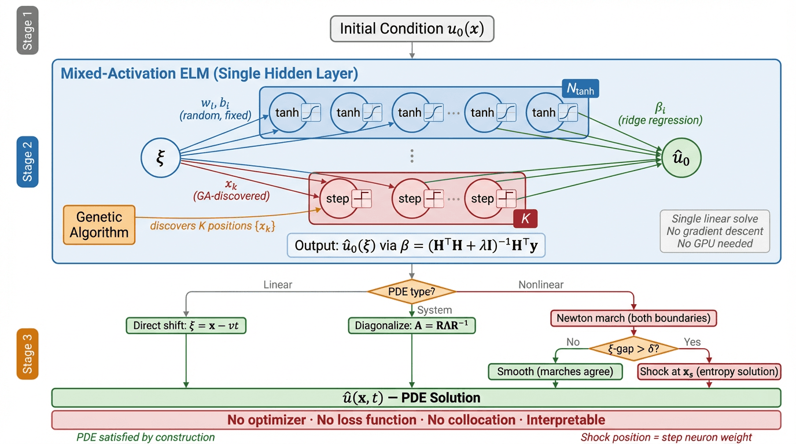
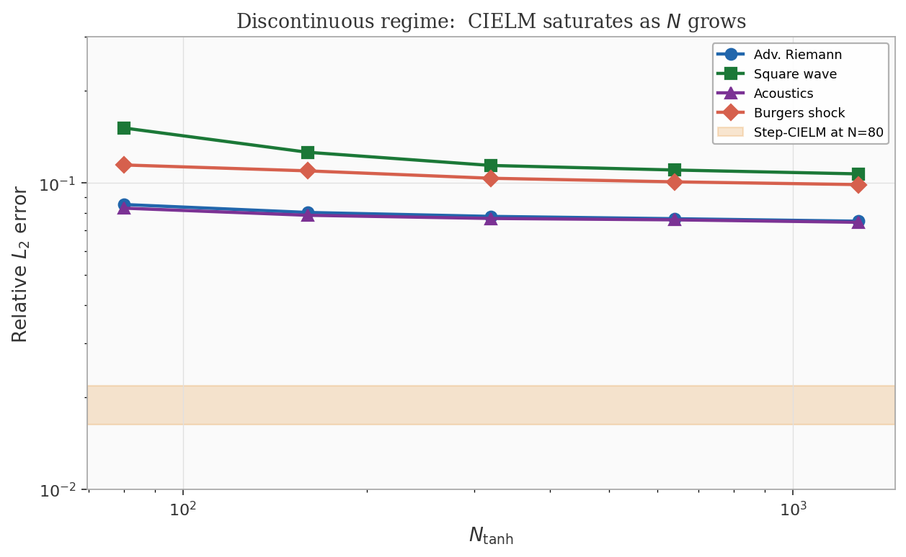
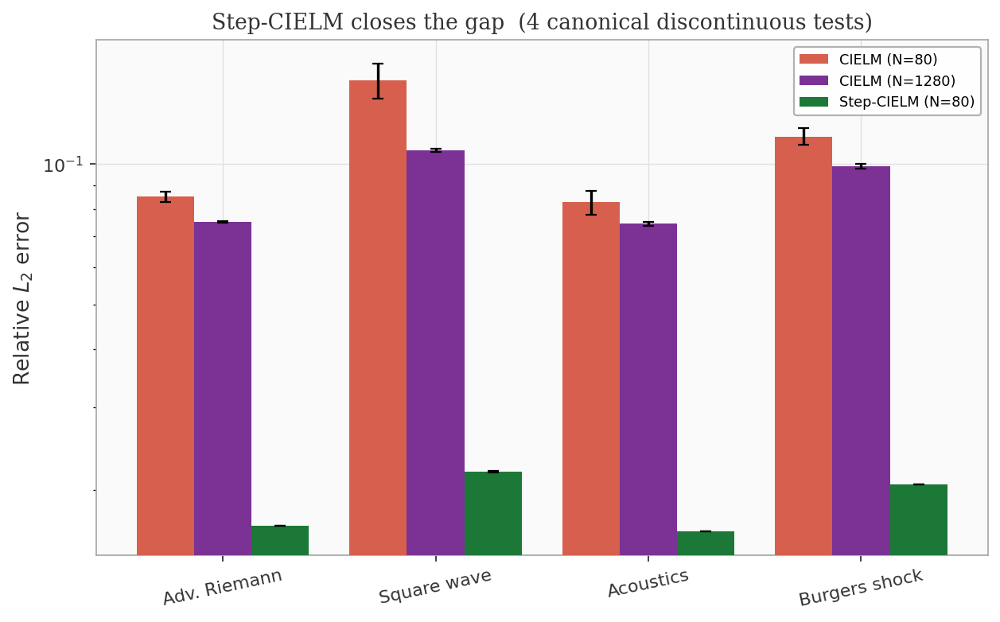
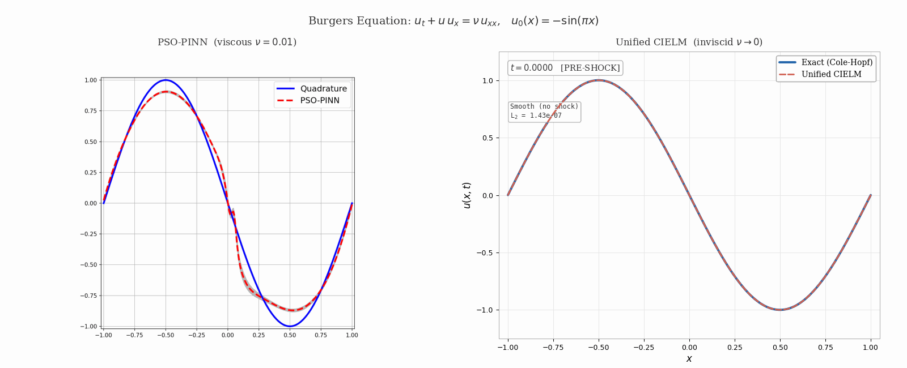

# Characteristics-Informed Extreme Learning Machines

Reference implementation for the paper

> **Characteristics-Informed Extreme Learning Machines for Smooth and
> Discontinuous Hyperbolic PDEs** -- Luis Loo and Ulisses Braga-Neto, 2026.

CIELM is a mesh-free solver for hyperbolic conservation laws that
combines the method of characteristics with a random-fixed tanh basis
trained analytically by ridge regression. Step-CIELM adds a small number
of sigmoid step neurons so that piecewise-smooth solutions with shocks,
Riemann jumps, or discontinuous initial data are represented exactly.
No gradient-descent loop, no PDE residual loss, no collocation points.

<p align="center">
  <br>
  <em>Fit the initial condition with a tanh (+ optional step) ELM, then
  evaluate the fitted basis at the characteristic coordinate. The PDE is
  satisfied by construction.</em>
</p>

## At a glance

**Smooth problems: CIELM beats the characteristics-informed baseline by
36–645×.** On the periodic advection stiffness benchmark of Braga-Neto
(2023), CIELM's error is flat at ~8×10⁻⁴ across transport velocities
v = 20, 30, 40, 50, while CINN and PINN degrade sharply.

<p align="center">
  
</p>

**Discontinuous problems: the smooth basis saturates.** A 16× increase
in the number of tanh neurons improves the error by only 1.1–1.4× on
four canonical Riemann benchmarks — the bottleneck is architectural,
not computational.

<p align="center">
  
</p>

**Step-CIELM closes the gap by 5–7×.** Adding a single step neuron at
the discontinuity recovers an order of magnitude in accuracy with
deterministic reproducibility across random seeds.

<p align="center">
  
</p>

**Inviscid Burgers: a single network handles pre- and post-shock.** The
unified solver smoothly transitions from a fixed-point iteration on the
smooth tanh basis (before shock formation) to Rankine–Hugoniot tracking
with a step neuron (after), without retraining.

<p align="center">
  
</p>

## Citation

```bibtex
@article{loo2026cielm,
  title  = {Characteristics-Informed Extreme Learning Machines
            for Smooth and Discontinuous Hyperbolic PDEs},
  author = {Loo, Luis and Braga-Neto, Ulisses},
  year   = {2026}
}
```

## Repository layout

```
.
├── README.md
├── LICENSE
├── requirements.txt
└── scripts/
    ├── _core.py          shared ELM primitives (ridge solve, fixed-point, plotting)
    ├── run_all.py        reproduce every experiment end-to-end
    ├── 01_periodic_advection_smooth.py
    ├── 02_saturation_sweep.py
    ├── ...
    └── 11_convergence_sensitivity.py
```

## Quick start

```bash
pip install -r requirements.txt
cd scripts
python 01_periodic_advection_smooth.py
```

Each numbered script is self-contained and writes its figures to
`scripts/figures/` and its numerical results (JSON) to
`scripts/results/`. To reproduce every experiment in order, run
`python scripts/run_all.py`.

## Scripts and paper sections

| Script | Paper section | Experiment |
|---|---|---|
| `scripts/01_periodic_advection_smooth.py`  | 6.1  | Periodic advection, smooth IC (velocity robustness) |
| `scripts/02_saturation_sweep.py`           | 6.2  | Saturation of the smooth basis on discontinuous problems |
| `scripts/03_linear_advection_riemann.py`   | 6.3  | Linear advection with Riemann IC |
| `scripts/04_periodic_square_wave.py`       | 6.4  | Periodic advection with a square-wave IC (step ablation) |
| `scripts/05_linear_acoustics.py`           | 6.5  | Linear acoustics system (2 x 2 hyperbolic) |
| `scripts/06a_burgers_shock.py`             | 6.6  | Inviscid Burgers: Riemann shock and rarefaction |
| `scripts/06b_burgers_smooth.py`            | 6.6  | Inviscid Burgers: smooth pre-shock and rarefaction |
| `scripts/06c_burgers_unified.py`           | 6.6  | Unified pre- and post-shock Burgers via Newton continuation |
| `scripts/07a_variable_velocity_x.py`       | 6.7  | Space-varying transport velocity v(x) = x |
| `scripts/07b_variable_velocity_t.py`       | 6.7  | Time-varying transport velocity v(t) = cos(omega t) |
| `scripts/08_two_d_advection.py`            | 6.8  | Two-dimensional linear advection |
| `scripts/09_regression_discontinuities.py` | 6.9  | Regression with unknown discontinuities (GA) |
| `scripts/10_ga_step_discovery.py`          | 6.10 | Step discovery from data for a PDE with unknown IC |
| `scripts/11_convergence_sensitivity.py`    | 6.11 | Convergence with N, sensitivity to kappa, numerical stability |

## Requirements

NumPy, SciPy, and Matplotlib (see `requirements.txt`). No GPU or deep
learning framework is required; every experiment runs on a laptop CPU.

## License

MIT.

## Affiliation

Department of Electrical and Computer Engineering, Texas A&M University.
