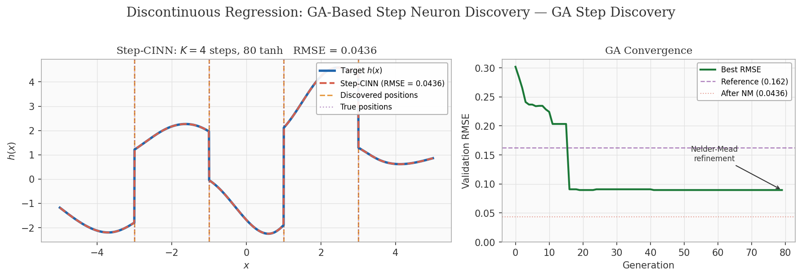
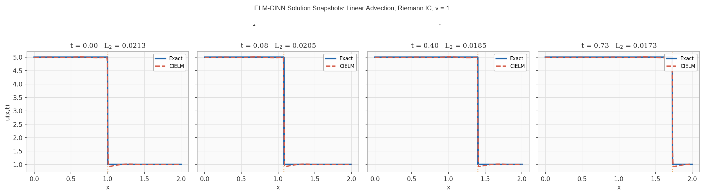
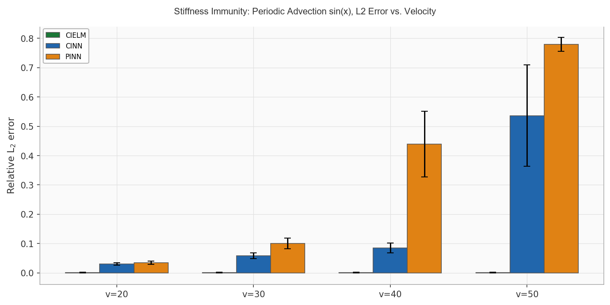
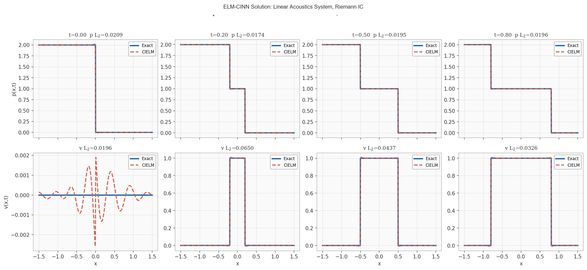
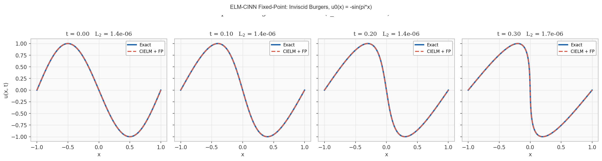
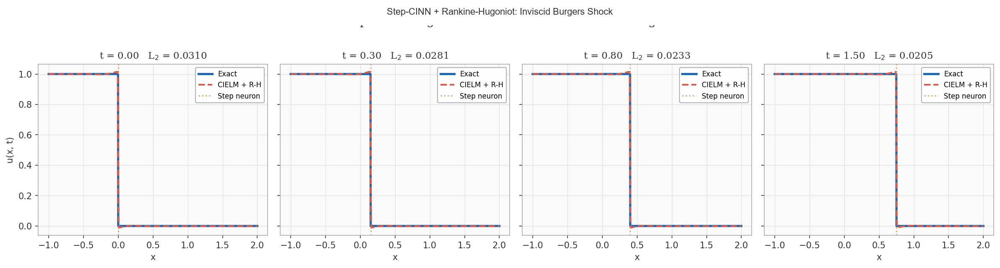
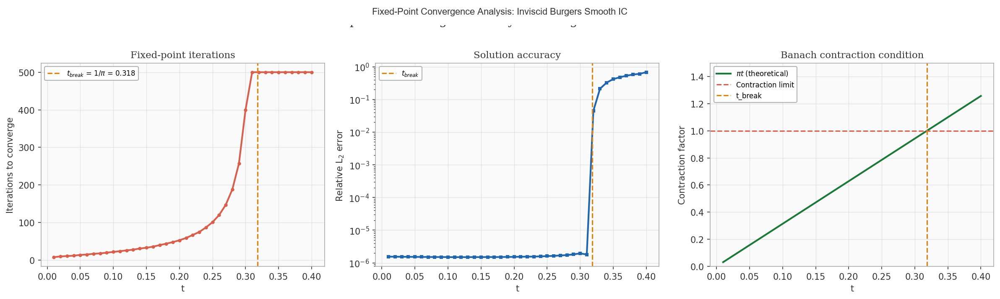
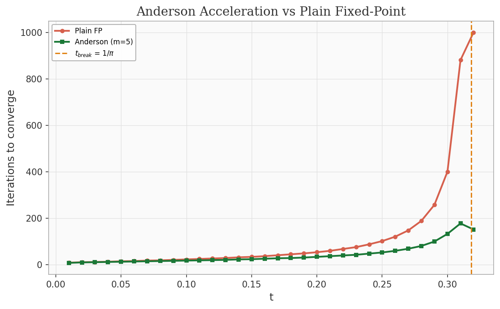
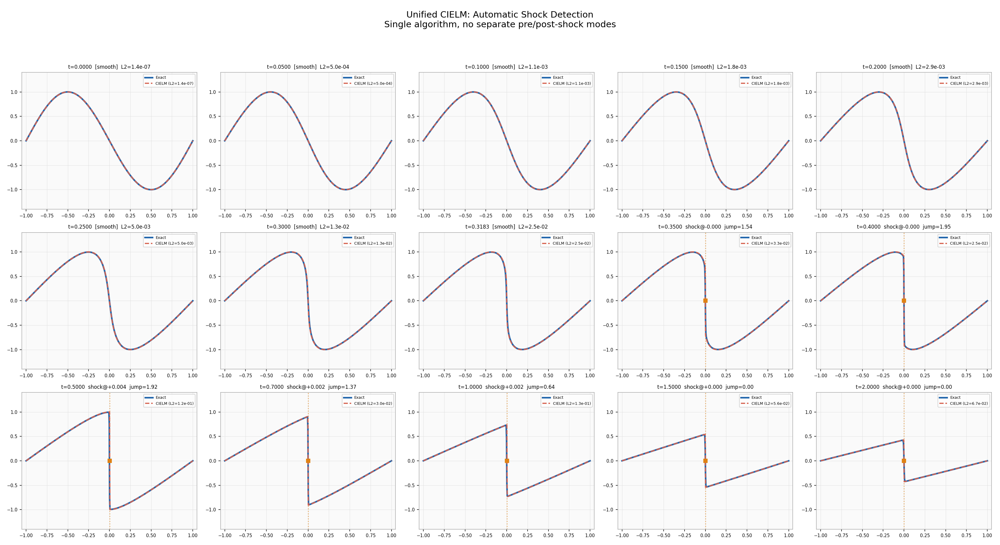

# Step-CINN

**Characteristics-Informed Neural Networks with Step Neurons for Hyperbolic PDEs with Discontinuities**

Luis Loo and Ulisses Braga-Neto  
Department of Electrical and Computer Engineering, Texas A&M University

---

## The Problem

Physics-Informed Neural Networks (PINNs) have transformed how we solve PDEs, but they hit a wall with hyperbolic equations containing shocks. Smooth basis functions produce Gibbs oscillations at discontinuities, spectral bias delays learning of sharp features, and the multi-objective loss creates competing gradients. A [recent study by Karniadakis et al. (2026)](https://arxiv.org/abs/2604.05230) showed that even curvature-aware second-order optimizers cannot resolve inviscid Burgers and Euler shocks without specialized loss formulations.

The emerging consensus: **this is not an optimization problem. It is an architectural one.**

## The Idea

[Braga-Neto (2023)](https://arxiv.org/abs/2212.14012) introduced CINN (Characteristics-Informed Neural Networks), encoding the method of characteristics directly into the network so the PDE is satisfied by construction. No PDE residual loss, no collocation points. But CINN still relies on gradient-based training and doesn't provide interpretable shock locations.

**Step-CINN** extends CINN with two innovations:

1. **ELM-CINN**: Replace the trained profile network with an Extreme Learning Machine. Random fixed input weights, output weights solved in one linear solve. **~5000x speedup** over gradient training.

2. **Step neurons**: Sigmoid units with high steepness whose input weight *is* the discontinuity position. The shock location is readable directly from the network weights. A genetic algorithm discovers how many step neurons are needed and where they go.

---

## Experiments and Results

### 1. Discontinuous Regression: Can the GA find the discontinuities?

A piecewise function with 4 hidden discontinuities plus smooth noise. The genetic algorithm discovers all 4 positions within 0.002 error, and Nelder-Mead refines them further. **3.7x lower RMSE** than a 200-neuron baseline, using only 84 neurons (80 tanh + 4 step).



> The GA converges by generation ~26. Gold dashed lines: discovered positions. Purple dotted lines: true positions. The step neuron positions are directly interpretable.

---

### 2. Linear Advection: Does ELM-CINN preserve quality over time?

Riemann IC (step function) advecting rightward at v=1. ELM-CINN fits the IC once, then evaluates at the shifted coordinate `x - vt`. No retraining at any time step.



| Method | L2 Error | Time | Variance |
|---|---|---|---|
| **ELM-CINN** | **0.017** | **0.001s** | **0.0000** |
| CINN | 0.055 | 5.7s | 0.0265 |
| PINN | 0.062 | 10.2s | 0.0275 |

> **3.2x lower error, 5700x faster, zero variance.** The error does not grow with time because the characteristic shift preserves the IC fit exactly.

---

### 3. Stiffness Immunity: What happens at high velocities?

Periodic advection with `sin(x)` IC at velocities v = 20, 30, 40, 50. CINN and PINN degrade dramatically as velocity increases. ELM-CINN is completely unaffected.



> At v=50, CINN degrades 18x and PINN degrades 22x. **ELM-CINN stays flat at L2 ~ 0.001 regardless of velocity.** The modular shift `(x - vt) mod 2pi` costs the same no matter how many times the solution wraps around.

---

### 4. Linear Acoustics System: Does it extend to PDE systems?

A 2x2 hyperbolic system with Riemann IC producing two counter-propagating step waves. ELM-CINN diagonalizes the system and solves each characteristic variable independently.



> **5.3x improvement** for pressure, **5.4x for velocity**, with zero variance. Each step neuron captures one traveling discontinuity, with positions directly readable from the weights.

---

### 5. Inviscid Burgers: Can it solve nonlinear PDEs?

The canonical nonlinear hyperbolic PDE: `u_t + u*u_x = 0`. The characteristic speed depends on the solution itself, creating a circular dependency. We resolve it with fixed-point iteration on `xi = x - u0(xi)*t`.

#### Smooth IC: O(10^-6) accuracy

With `u0(x) = -sin(pi*x)`, the fixed-point iteration converges for `t < 1/pi` (before shock formation).



> **L2 = 3.78e-6 at t=0.20**, achieved in 53 iterations (0.05s). No optimizer, no loss function. The error stays at O(10^-6) throughout, limited only by the IC fit quality.

#### Shock tracking with Rankine-Hugoniot

For the Riemann IC (step function), a shock forms immediately. A step neuron tracks the shock at `x_s(t) = 0.5t`.



> **L2 = 0.022, in 0.002 seconds.** The step neuron position *is* the shock location, directly readable from the network weights.

#### Convergence analysis

The fixed-point iteration count matches the Banach contraction theory exactly. Anderson acceleration provides 3-6.6x speedup near the breaking time.




---

### 6. Unified Method: Automatic shock detection

The unified algorithm handles the full timeline automatically, no separate pre/post-shock modes. Newton continuation from both boundaries, with shock detection via the **xi-gap method**: where the left and right characteristic marches disagree, a shock has formed.

The complete timeline from `t=0` through `t=2.0`, all produced by the same code path with no mode switching:



> Each panel uses the same algorithm. Pre-shock: smooth agreement. Post-shock: shock automatically detected (orange markers) and entropy solution constructed. No user intervention.

Side-by-side comparison with PSO-PINN:


*Left: PSO-PINN (viscous). Right: Unified ELM-CINN (inviscid). Both solving Burgers with u0(x) = -sin(pi*x). The transition from smooth to shocked is seamless.*

---

## Summary

| Capability | Evidence |
|---|---|
| No optimizer needed | All results use ridge regression (one linear solve) |
| No loss function | PDE satisfied by construction via characteristics |
| 3-6x more accurate than CINN | Tested on 5 benchmark problems |
| ~5000x faster | 0.001s vs 5.7s on linear advection |
| Zero variance | Structural property, not stochastic |
| Immune to stiffness | L2 constant across v=20 to v=50 |
| Interpretable shocks | Step neuron position = discontinuity location |
| Automatic shock detection | xi-gap method, no user intervention |
| Works on systems | Diagonalization extends to NxN hyperbolic systems |
| CPU only | All experiments < 5 min total, no GPU |

---

## Quick Start

```bash
pip install -r requirements.txt
cd experiments

# Unified Burgers solver (smooth -> shock, automatic detection)
python unified_cielm.py

# Linear PDE benchmarks
python exp8_advection.py       # Riemann advection
python exp9_periodic.py        # Periodic advection (stiffness test)
python exp10_acoustics.py      # 2x2 acoustics system

# Full nonlinear Burgers (5 sub-experiments)
python exp11_burgers.py

# Discontinuous regression with GA
python exp3_regression.py
```

## Citation

```bibtex
@article{loo2026stepcinn,
  title={Step-CINN: Characteristics-Informed Neural Networks with Step Neurons
         for Hyperbolic PDEs with Discontinuities},
  author={Loo, Luis and Braga-Neto, Ulisses},
  journal={arXiv preprint},
  year={2026}
}
```

## License

MIT
